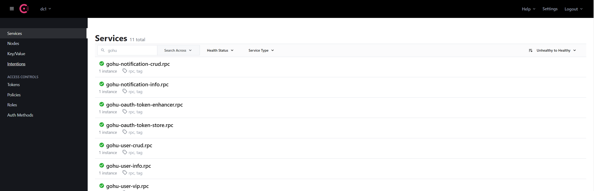
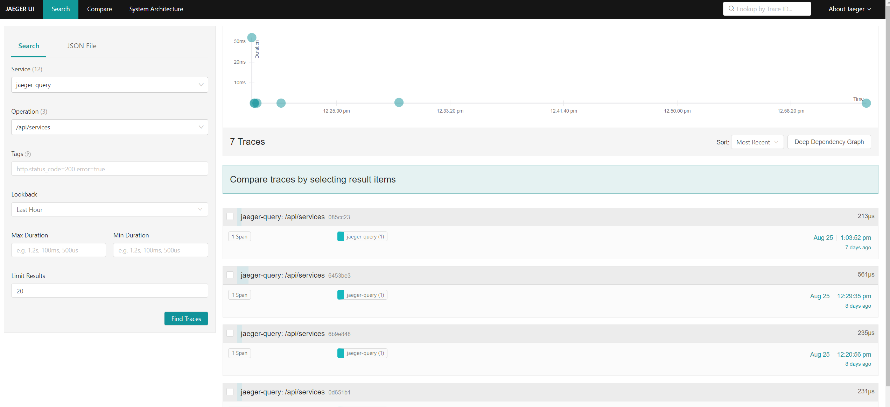
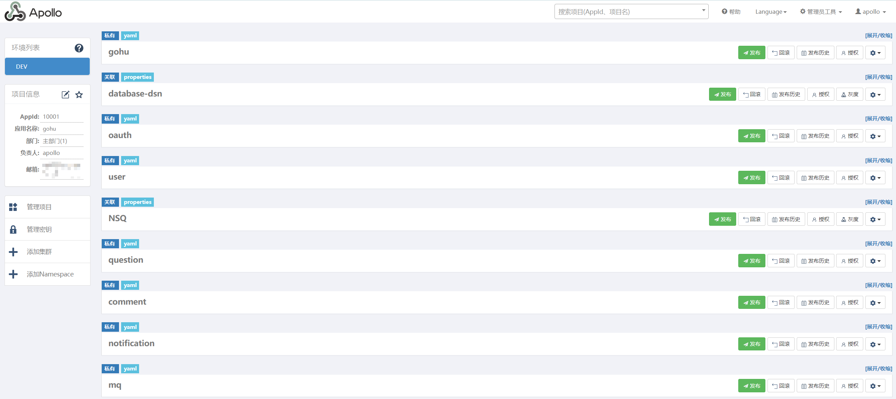
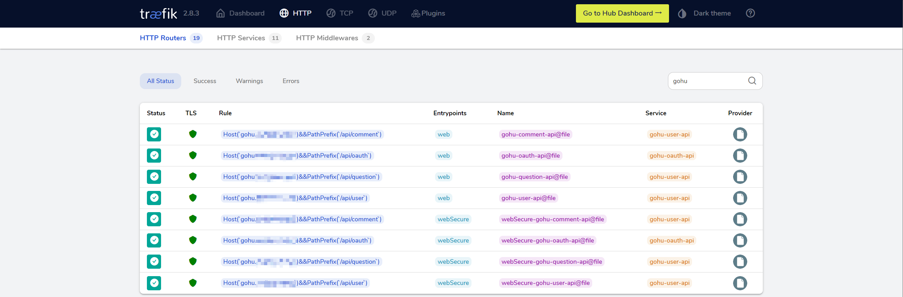
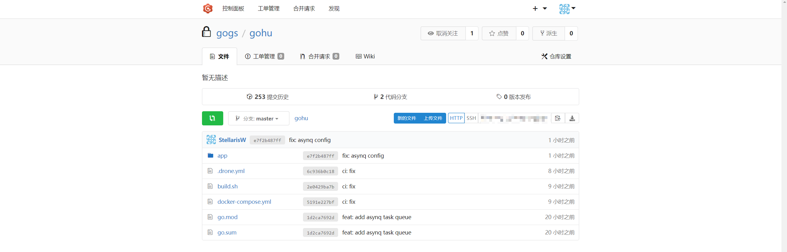
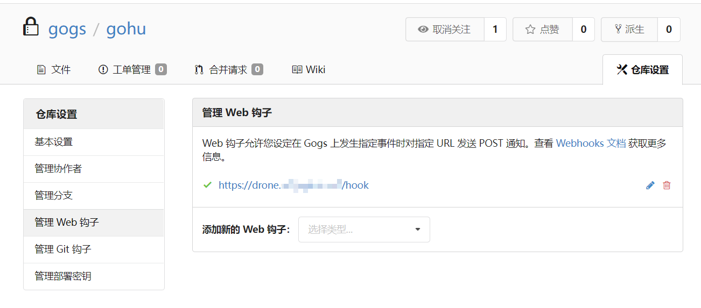
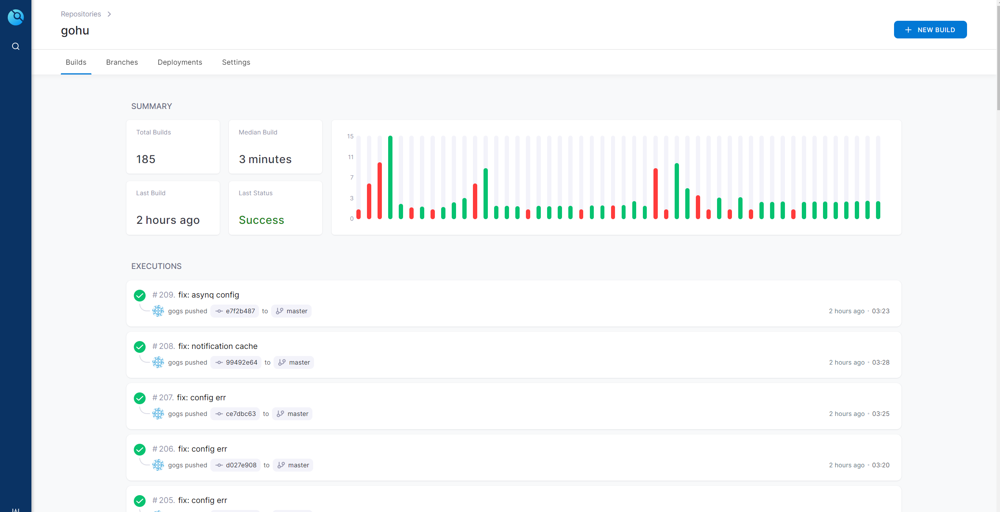
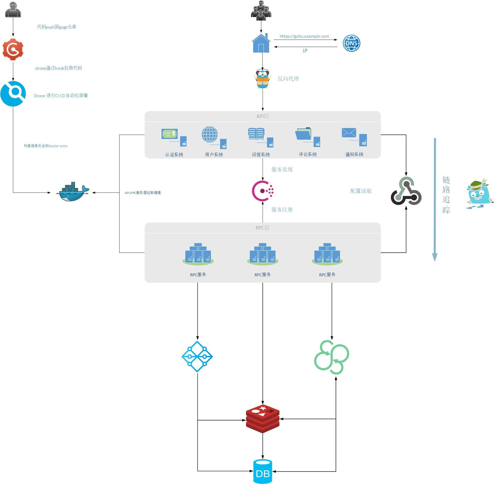

# gohu

[](https://github.com/StellarisW/StellarisW)[](https://github.com/StellarisW/StellarisW)[](http://opentracing.io)[](https://github.com/emirpasic/gods/blob/master/LICENSE)

> go实现的知乎网站后端

## 💡  简介

基于[go-zero](https://github.com/zeromicro/go-zero)微服务框架实现的一个简单知乎网站后端

## 🚀 功能

### 认证系统

- 颁发 `oauth2 token`  (包含 `access token` 和 `refresh token`)
- 对令牌进行解析获取认证信息与用户信息

### 用户系统

- 用户的登录与注册
- 用户改名
- 喜欢或赞同回答、评论
- 关注用户
- 收藏回答
- 获取自己的回答与评论

### 问答系统

- 对问题的增删查改
- 对回答的增删查改

### 评论系统

- 对回答进行评论
- 可以对评论进行回复

### 通知系统

- 发布的问题被回答会得到通知
- 问题的回答被评论会得到通知
- 评论被回复会得到通知
- 回答或评论被点赞会得到通知
- 回答被收藏会得到通知

## 🌟 亮点

### 技术栈

- [go-zero](https://go-zero.dev/)

> 一个集成了各种工程实践的包含 微服务框架
>
> 它具有高性能（高并发支撑，自动缓存控制，自适应熔断，负载均衡）、易拓展（支持中间件，方便扩展，面向故障编程，弹性设计）、低门槛（大量微服务治理和并发工具包、goctl自动生成代码很香），

​     同时go-zero也是现在最流行的go微服务框架，所以本项目采用go-zero为主框架搭建知乎后端

- [mysql](https://www.mysql.com/)

> 一个关系型数据库管理系统，由瑞典MySQL AB 公司开发，属于 Oracle 旗下产品。MySQL 是最流行的关系型数据库管理系统关系型数据库管理系统之一，在 WEB 应用方面，MySQL是最好的 RDBMS (Relational Database Management System，关系数据库管理系统) 应用软件之一

​    遇事不决还得是mysql，后续有空（有钱）会改进成 [TiDB](https://pingcap.com/zh/case/)，将其分布式化

- [redis](https://redis.io/)

> 一个开源的、使用C语言编写的、支持网络交互的、可基于内存也可持久化的Key-Value数据库

​    缓存存储还是选型最普遍的redis

- [nsq](https://nsq.io/)

>  Go 语言编写的开源分布式消息队列中间件，具备非常好的性能、易用性和可用性

​    刚开始想用RabbitMQ，但是很难做到集群和水平扩展，再看了看其他的队列组件（Darner，Redis，Kestrel和Kafka），每种队列组件都有不同的消息传输保     	证，但似乎并没有一种能在可扩展性和操作简易性上都比较优秀的产品。

​    然后就看到了nsq，支持横向拓展，性能也很好，同时也是go语言原生开发的，因此选型nsq做发布订阅操作（通知系统里会用到）

- [asynq](https://github.com/hibiken/asynq)

> go语言实现的高性能分布式任务队列和异步处理库，基于redis，类似sidekiq和celery

​	asynq是一个分布式延迟消息队列，本项目用它进行异步定时任务处理（缓存与数据库之间的同步操作）

- [consul](https://www.consul.io/)

> 一套开源的分布式服务发现和配置管理系统，由HasiCorp公司用go语言开发的。提供了微服务系统中服务助理、配置中心、控制总线等功能

​	在consul和etcd之间比较，consul的服务发现很方便，也有健康检查，多数据中心等功能，同时也是go云原生项目，因此选型consul

- [jaeger](https://www.jaegertracing.io/)

> 由Uber开源的分布式追踪系统

​	go-zero框架集成了对jaeger的支持，因此使用jaeger做追踪系统

- [apollo](https://www.apolloconfig.com/)

> 一款可靠的分布式配置管理中心，诞生于携程框架研发部，能够集中化管理应用不同环境、不同集群的配置，配置修改后能够实时推送到应用端，并且具备规范的权限、流程治理等特性，适用于微服务配置管理场景

​	使用apollo做配置管理系统，可以有效的在认证系统，用户系统，问答系统等等不同的环境下进行配置的管理

- [traefik](https://www.jaegertracing.io/)

> 一个为了让部署微服务更加便捷而诞生的现代HTTP反向代理、负载均衡工具

​	本项目写的微服务很多，用nginx难管理，也比较懒得写配置文件，所以用traefik，虽然性能没nginx好，但是对微服务的反向代理和负载均衡的支持很便捷，

​	同时使用traefik中的http中间件，oauth proxy也很方便

- [docker](https://www.docker.com/)

> Google 公司推出的 Go 语言 进行开发实现，基于 Linux 内核的 cgroup，namespace，以及 AUFS 类的 Union FS 等技术的一个容器服务

​	容器用docker-compose部署

- [drone](https://www.drone.io/)

> 一款基于go编写的容器技术持续集成工具，可以直接使用YAML配置文件即可完成自动化构建、测试、部署任务

​	结合gogs仓库，来对项目进行CI/CD持续集成，部署更方便了

### 后端

#### 认证系统

- 颁发令牌

> 对向OAuth2服务器发送请求颁发令牌的客户端进行鉴权, 鉴权成功后 颁发token
>
> 提高了令牌的安全性, 同时也可以根据客户端信息自定义 Oauth2 token

- 令牌存储

> token存储在redis中, 自动实现令牌的过期功能
>
> 加快用户的鉴权操作

- 令牌刷新

> access token的过期时间为1天，refresh token的过期时间为7天，当access token过期后，服务器会自动使用一次性的refresh token 对access token进行刷新操作，获取新的access token。
>
> 这样会有效降低因 access token 泄露而带来的风险。

- 令牌传递

> 使用Cookie进行在用户与服务器之间的Oauth2 token传递，同时对cookie进行SHA256加盐，保证了cookie与token的安全性
>
> 在认证中间件中(app/common/middware/authMiddleware.go)对cookie进行哈希校验，防止用户篡改，校验通过后解析cookie自动获取token的元信息

#### 用户系统

- 登录与注册

> 用户注册或首次登录得到令牌，可以在令牌有效期内实现自动登录操作，
>
> 在用户注册或登录后设置注册/登录缓存，同时特别针对登录设置了空缓存，防止大量无效请求造成缓存穿透

- IP 归属地

> 对用户登录的IP进行解析（具体看我 [ip-parse](https://github.com/StellarisW/ip-parse) 仓库），在回答内容，评论内容中设置用户IP归属地

- 用户信息缓存

> 对`user-subject`,`user-collect`表进行缓存，针对高频更新的字段(如 `user-subject` 中的 `follower` ， `user-collect` 中的赞同操作)进行定时更新数据库的操作

#### 问答系统

- 问题与回答信息缓存

> 也是和上面一样的逻辑，对表进行缓存，高频字段定时数据库同步

#### 评论系统

- 低耦合

> 将评论这个模块单独从回答中抽离出来，方便后续的功能需要评论模块的使用

- 信息全面

> 显示回复的用户id和被回复的用户id，回复的ip归属地等等

#### 通知系统

- 发布订阅

> 使用nsq对用户的各种操作(如关注，点赞等等)对操作的对象(被关注的人，被点赞回答的作者)进行通知

- 缓存与数据库同步处理

> 因为通知是个高频操作，所以数据库进行定时同步

### 运维

#### 服务发现

> 通过go-zero框架的原生支持，来进行服务的发现与调用操作



#### 链路追踪

> 通过go-zero框架的原生支持，进行对服务的链路追踪，方便debug

 

#### 配置管理

> 在apollo平台上进行配置的更改操作，然后go后端读取apollo的配置文件后，缓存在本地，同时进行配置的热更新，
>
> 然后使用viper来进行配置文件的读取操作



#### 网关代理

> 使用traefik对微服务进行反向代理，同时自动生成CA证书，对全部的微服务进行tls认证



#### 项目部署

> 代码push到gogs仓库



> drone通过web钩子拷贝代码



> drone进行持续集成操作



> docker-compose 并发构建镜像

`build.sh`

``` sh
#!/bin/bash

export PROJECT_NAME=$1

export THREAD=$2

docker_names=('oauth-api' 'oauth-rpc-token-enhancer' 'oauth-rpc-token-store' \
'user-api' 'user-rpc-crud' 'user-rpc-info' 'user-rpc-vip' 'notification-api' \
'notification-rpc-crud' 'notification-rpc-info' 'mq-asynq-scheduler' 'mq-asynq-processor' \
'mq-nsq-consumer')

function docker_build() {
  if [ "$1" -ef "" ]; then
    return 0
  fi

  array=$(echo "$1" | tr '-' '\n')
  path='./app/service'
  for var in $array
  do
    path="${path}""/""${var}"
  done
  docker build -t "$PROJECT_NAME""_""$1" "${path}"
  return 1
}

[ -e /tmp/fd1 ] || mkfifo /tmp/fd1
exec 3<>/tmp/fd1
rm -rf /tmp/fd1

for ((i=1;i<=THREAD;i++))
do
  echo >&3
done

cd /www/site/"$PROJECT_NAME" || exit

remain_build=${#docker_names[@]}

echo "start building images, remain: ""${remain_build}"

for docker_name in ${docker_names[*]}
do
  read -r -u3
{
  docker_build "${docker_name}"
  remain_build=$(expr "${remain_build}" - 1)
  echo "build ""${docker_name}"" complete, remain: ""${remain_build}"
  echo >&3
} &
done

wait

exec 3<&-
exec 3>&-
```

## 🗼架构设计



## 📖 API文档


## ⚙ 项目结构

<details>
<summary>展开查看</summary>
<pre>
<code>
    ├── app ----------------------------- (项目文件)
        ├── common ---------------------- (全局通用目录)
        	├── config ------------------ (获取配置文件相关)
        	├── log --------------------- (日志配置)
        	├── middleware -------------- (中间件)
        	├── model ------------------- (全局模型)
        	├── mq ---------------------- (消息队列设置)
        ├── service --------------------- (微服务)
            ├── comment ----------------- (评论系统)
            ├── mq ---------------------- (消息队列服务)
            ├── notification ------------ (通知系统)
            ├── oauth ------------------- (认证系统)
            ├── question ---------------- (问答系统)
            ├── user -------------------- (用户系统)
    ├── manifest ------------------------ (交付清单)
    	├── deploy ---------------------- (部署配置文件)
    		├── docker ------------------ (docker配置文件)
    		├── kustomize --------------- (k8s配置文件)
        ├── sql ------------------------- (mysql初始化配置文件)
    ├── utils --------------------------- (工具包)              
    ├── .drone.yml ---------------------- (drone自动构建配置文件)
    ├── docker-compose.yaml ------------- (docker-compose配置文件)
</code>
</pre>
</details>

## 🛠 环境要求

- golang 版本 ~= 1.19
- mysql 版本 ~=5.7
- redis 版本 ~=5.0

## 📌 TODO

- [x] OAuth授权服务器
- [x] 用户登录/注册
- [x] 发布问题
- [x] 回答问题
- [x] 评论回答
- [x] 获取自己的所有问题、回答、评论
- [x] 删除或修改自己发布的问题、回答、评论
- [x] 赞同
- [x] 关注
- [x] 收藏
- [x] 通知
- [ ] 热榜
- [ ] 盐选会员
- [ ] 文章

## 🎈 结语

